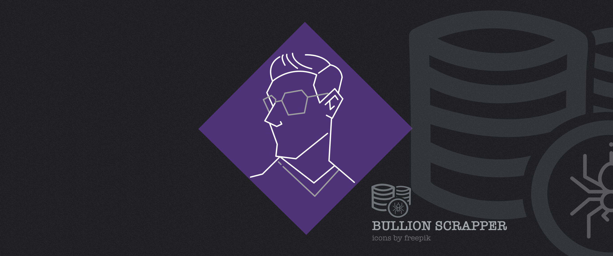

# Bullion Scrapper (metal_scrapper)
[](https://results.pre-commit.ci/latest/github/CubeVic/metal_scrapper/main)

Scrapper for bullion dealers in Taiwan.

The selection of the best deals doesn't follow any expert opinion or popularity of a specific coin or bar. It is focused only on lower premiums (under construction).

>## Warning
>If Someone decided to use the script, be aware I'm not a financial advisor, so do not take the results as such, I check
the robot files, and I follow the restrictions, and, I will lower the scrapping speed to don't overload any dealer's
websites

## Getting Started

2. Install Scrapy `https://scrapy.org/`
3. install packagues by poetry.

[//]: # (### Installing)

[//]: # ()
[//]: # (```)

[//]: # (pip install -r requirements.txt)

[//]: # (```)

[//]: # ()
[//]: # (And if the branch already implement the usage of splash we will need to run and launch docket )

[//]: # (with splash.)

## Deployment

```
scrapy crawl truney -O <FILENAME.json>
```
or

```
scrapy crawl kitco -O <FILENAME.json>
```

## Built With

* [Scrapy](https://scrapy.org/) - Scrapping framework

## Contributing

Not open yet for contribution. The project is basic and focuses on Asian Dealers.

## Versioning

We use [SemVer](http://semver.org/) for versioning.
Still working in the versions.

## Authors

* **Victor Andres Aguirre Fernandez** - *Initial work* - [CubeVic](https://github.com/CubeVic)

## License

Working in the license.

## Warning

Be careful investing in metals.
